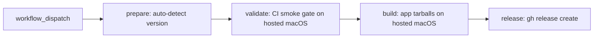

# 🏷️ Release process

How versions are assigned, CI stages a release, and you cut one locally.

## 🏷️ Versioning

CalVer: **`vYY.M.BUILD`** (e.g. `v26.6.0` = June 2026, build 0).

The tag is the single source of truth — it is not stored in `manifest.json`.

Used consistently for:

- Git tag and GitHub Release
- Tarball names: `<tool>-<version>-<arch>-apple-darwin.tar.gz`

## 🔁 Pipeline



1. **Prepare** — auto-detect next CalVer from existing tags (or accept manual override), emit CI and release matrices from the manifest
2. **Validate** — run the same smoke CI gate as `ci.yml`, respecting validation-only arch exclusions
3. **Build** — build app release tarballs for `arm64` and `x86_64` without running validation
4. **Release** — download artifacts, create GitHub Release with tarballs + sha256 sums

## ⚡ Triggering a release

Run `release.yml` via **Actions → Release → Run workflow**:

- Leave `version` empty to auto-detect next `vYY.M.BUILD`
- Or provide an explicit version like `v26.6.1`

The workflow validates the format, runs the smoke CI gate, builds clean release artifacts, and publishes.
Run full validation locally before dispatching if the release includes runtime-sensitive changes.

## 💻 Local release

Pick a CalVer tag (e.g. `v26.6.0`). No push until you review locally:

```sh
VERSION=v26.6.0

# 1. Update manifest.json pinned refs as needed
# 2. Full GPU validation on your Mac
./scripts/dist.sh validate llama-cpp --full
./scripts/dist.sh validate whisper-cpp --full
./scripts/dist.sh validate stable-diffusion-cpp --full
./scripts/dist.sh validate transcribe-cpp --full

# Run the sequential full suite manually on a qualified macOS Metal host.


# 3. Build artifacts locally
./scripts/dist.sh build llama-cpp --arch x86_64 --version "$VERSION"
./scripts/dist.sh build llama-cpp --arch arm64 --version "$VERSION"
# ... repeat for whisper-cpp, stable-diffusion-cpp, transcribe-cpp

# 4. Create release (dry run first)
./scripts/dist.sh publish-release --version "$VERSION" --dry-run
./scripts/dist.sh publish-release --version "$VERSION"
```

Review all changes locally before pushing tags or branches.

## 🔄 Validate upstream refs

Use `ci.yml` when `manifest.json` changes `upstream_ref` values and you want to validate the rebuild set before release.

- Renovate application PRs validate only affected applications.
- Renovate ggml PRs reconcile ggml locally and validate all application builds against that reconciled source.
- Workflows never push the reconciled ggml fork. Inspect local reconcile output under `scripts/dist/work/reconcile/ggml` or a custom `--work-dir`, then push manually with `git` if desired.
- The workflow does not push application forks; applications build from upstream refs with app compatibility patches applied locally.

Local rehearsal:

```sh
python3 scripts/manifest_cli.py affected-tools --base-ref HEAD build
python3 scripts/manifest_cli.py matrix build --affected --base-ref HEAD
./scripts/dist.sh reconcile-ggml --dry-run --base-ref HEAD
```

## ➕ Adding a tool

CI matrices and release builds are driven by [`manifest.json`](../manifest.json).
To add a tool, edit the manifest only — workflows pick it up via [`scripts/manifest_cli.py`](../scripts/manifest_cli.py).

1. Add a `repos.<key>` entry (`upstream_url`, `upstream_ref`, and `ggml_path` only if the app does not use `ggml/`; only `ggml` has `url` and `branch`).
2. Add a `tools.<name>` entry with build/cmake settings and a `pipelines` list:

    - `unit` — unit-level smoke tests
    - `build` — build-smoke validation and prebuilt release tarballs (GH-hosted CI)
    - `release` — included in GitHub Release artifacts
    - `integration` — integration tests with models
    - `performance` — benchmark runs
3. Add `tools.<name>.models.smoke` and `models.full` arrays if the tool runs model validation (see existing tools for field shapes).
4. Add `scripts/validate/<tool>.sh` (filename must match the tool key).

Example — a tool that only gets unit smoke-tested:

```json
"my-tool": {
  "repo": "my-tool",
  "pipelines": ["unit"],
  ...
}
```

Preview matrices locally:

```sh
python3 scripts/manifest_cli.py matrix build
python3 scripts/manifest_cli.py matrix release
python3 scripts/manifest_cli.py brew-deps build
```
